🕵️ Threat Hunt Report
The Broker

# Attack Flow Diagram – The Broker

```mermaid
flowchart LR

A[User Opens Fake Resume<br>Daniel_Richardson_CV.pdf.exe]
--> B[Initial Compromise<br>as-pc1]

B --> C[Credential Theft Tool Loaded<br>SharpChrome]
C --> D[Reflective .NET Load<br>ClrUnbackedModuleLoaded]

D --> E[Injected into notepad.exe]

E --> F[Lateral Movement via RDP<br>mstsc.exe]

F --> G[as-pc2]
G --> H[Accessed Payroll Share<br>BACS_Payments_Dec2025.ods]

H --> I[Archive Created<br>Shares.7z]

I --> J[Persistence Created<br>Scheduled Task + svc_backup]

J --> K[Logs Cleared<br>System, Application]
```

📌 Executive Summary

An attacker broke into the network.

They:

Used stolen credentials.

Moved from one computer to another.

Created a fake admin account.

Installed a hidden scheduled task.

Stole payroll data.

Cleared logs to hide their tracks.

Loaded a credential-stealing tool directly into memory.

Injected that tool into a normal Windows program to avoid detection.

Even though they tried to hide, we found everything.

🎯 Scope of Investigation

Time Range:

let t0 = datetime(2026-01-15 03:40:00);
let t1 = datetime(2026-01-15 07:30:00);

Systems Investigated:

as-pc1

as-pc2

as-srv

🧭 Attack Timeline (Plain English)
Time	What Happened
~03:31	Malicious PDF executable launched
~04:29	Lateral movement via RDP
~04:46	Payroll document accessed and modified
~04:52	Payload downloaded & renamed
~05:09	Reflective .NET module loaded in memory
~05:16	Defender alert triggered for assembly injection
After	Logs cleared to hide evidence
🔓 Initial Access

The attacker tricked a user into running:

Daniel_Richardson_CV.pdf.exe

This file:

Was disguised as a resume

Was actually malware

Had SHA256:

48b97fd91946e81e3e7742b3554585360551551cbf9398e1f34f4bc4eac3a6b5
🧱 Lateral Movement

The attacker attempted multiple remote execution methods:

wmic.exe

PsExec.exe

These failed.

They succeeded using:

mstsc.exe

Movement path:

as-pc1 > as-pc2 > as-srv

Compromised account:

david.mitchell
🧬 Persistence
Scheduled Task Created

Task name:

MicrosoftEdgeUpdateCheck
Renamed Payload
RuntimeBroker.exe

SHA256:

48b97fd91946e81e3e7742b3554585360551551cbf9398e1f34f4bc4eac3a6b5
Backdoor Account Created
svc_backup
💰 Data Access & Staging
Sensitive File Accessed
BACS_Payments_Dec2025.ods
Proof It Was Edited
.~lock.BACS_Payments_Dec2025.ods#

Access origin:

as-pc2
Data Archived for Exfiltration

Archive created:

Shares.7z

SHA256:

6886c0a2e59792e69df94d2cf6ae62c2364fda50a23ab44317548895020ab048
🧨 SECTION 9: Anti-Forensics & Memory

This is where the attacker tried hardest to hide.

🚩 Log Clearing

The attacker cleared Windows event logs using:

wevtutil.exe

Logs cleared:

System, Application
KQL Evidence
let t0 = datetime(2026-01-15 03:40:00);
let t1 = datetime(2026-01-15 07:30:00);
SecurityEvent
| where TimeGenerated between (t0 .. t1)
| where EventID == 4688
| extend NewProcessName = tostring(EventData.NewProcessName),
         CommandLine = tostring(EventData.CommandLine)
| where NewProcessName endswith @"\wevtutil.exe"
| where CommandLine has " cl "
| project TimeGenerated, Computer, Account, CommandLine

Observed:

wevtutil.exe cl System
wevtutil.exe cl Application

MITRE: T1070.001 – Clear Windows Event Logs

🚩 Reflective Loading

The attacker loaded a .NET assembly directly into memory.

No file was written to disk.

Recorded ActionType
ClrUnbackedModuleLoaded

This means:

A .NET module was loaded into memory without a backing file.

That is textbook reflective loading.

KQL Evidence
let t0 = datetime(2026-01-15 03:40:00);
let t1 = datetime(2026-01-15 07:30:00);
DeviceEvents
| where Timestamp between (t0 .. t1)
| where ActionType == "ClrUnbackedModuleLoaded"
| extend AF = parse_json(AdditionalFields)
| project Timestamp, DeviceName, AF
🚩 Memory Tool Identified

The injected module name:

SharpChrome

SharpChrome is:

A .NET credential theft tool

Used to dump browser-stored passwords

Frequently executed reflectively

🚩 Host Process

The malicious .NET assembly was injected into:

notepad.exe

This is classic defense evasion:

Hide malicious code inside a trusted Windows process

Blend in with normal system activity

🧠 Why This Matters

The attacker:

Cleared logs to hide evidence

Used fileless malware

Injected code into trusted processes

Stole payroll financial data

Created persistent access

Used stolen credentials for movement

This is human-operated intrusion activity — not automated malware.

🛡 MITRE ATT&CK Mapping
Technique	ID
Process Injection	T1055
Reflective Code Loading	T1620
Clear Windows Event Logs	T1070.001
Scheduled Task Persistence	T1053
Credential Dumping (Browser)	T1555
Remote Services (RDP)	T1021
Account Manipulation	T1098
📊 Final Findings Summary
Category	Result
Logs Cleared	System, Application
Reflective Load ActionType	ClrUnbackedModuleLoaded
In-Memory Tool	SharpChrome
Host Process	notepad.exe
Sensitive Data	Payroll ODS File
Archive Staged	Shares.7z
Backdoor Account	svc_backup
🧾 Conclusion (Simple Version)

The attacker:

Got in using a fake resume.

Moved between machines.

Created persistence.

Stole payroll data.

Tried to erase their tracks.

Used advanced memory injection to avoid detection.

Even though they tried to hide,
the telemetry told the full story.

🏁 Final Assessment

This incident demonstrates:

Advanced memory-based attack techniques

Credential harvesting

Anti-forensics log clearing

Lateral movement with valid credentials

Data staging prior to exfiltration

This was not a script kiddie.
This was an operator.
